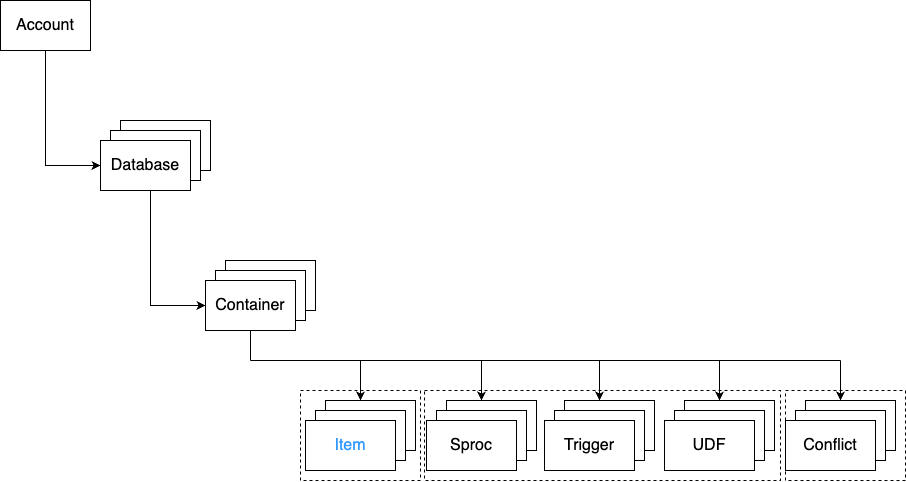

# Explaining the requirements for Azure Cosmos DB for NoSQL

The TfW team needs to provide requirements for Azure Cosmos DB. It might be helpful if we explain the different resources that make up Cosmos DB for NoSQL and what types of settings we can set up at each resource level. This might help the TfW team make an informed decision.

## Explore resources

An Azure Cosmos DB for NoSQL account is composed of a basic hierarchy of resources that include:

- An account
- One or more databases
- One or more containers
- Many items


Let's explore each item in the hierarchy individually.

## Account

Each tenant of the Azure Cosmos DB service is created by provisioning a database account. Accounts are the fundamental units of data distribution, high availability and security. At the account level, you can configure the region[s] for your data in Azure Cosmos DB for NoSQL. Accounts also contain the globally unique DNS name used for API requests.


### Account Requirements

As we now know, we need to decide two key requirements at the account level:
1. The region[s] configuration
2. Optionally, the DNS name 

## Database

A database is a logical unit of management for containers in Azure Cosmos DB for NoSQL. Within a database, you can find one or more containers.


### Database Requirements

There isn't anything to think about in-terms of database requirements, except of how many containers we want to add in them. We already know that we will have the ```APC``` and the ```TCMS``` containers in our project for Phase 7

## Container

Containers are the fundamental unit of scalability in Azure Cosmos DB for NoSQL. Typically, you provision throughput at the container level but you can use Serverless as well. Azure Cosmos DB for NoSQL will automatically and transparently partition the data in a container using the document property you select as a partition key for the container. You can also optionally configure indexing policies or a default time-to-live value at the container level.

<strong><em>Indexing Policies:</em></strong> 

In Azure Cosmos DB, every container has an indexing policy that dictates how the container's items should be indexed. The default indexing policy for newly created containers indexes every property of every item and enforces range indexes for any string or number. According to Microsoft, this allows you to get good query performance without having to think about indexing and index management upfront. 

In some situations, you might want to override this automatic behavior to better suit your requirements. You can customise a container's indexing policy by setting its indexing mode, and include or exclude property paths. [Read more here](https://learn.microsoft.com/en-us/azure/cosmos-db/index-policy)

<strong><em>Time-to-live Value:</em></strong> 

The time-to-live value is set in seconds, and is interpreted as a delta from the time that an item was last modified. You can set time to live on a container or an item within the container:

1. <strong>Time to Live on a container</strong> (set using DefaultTimeToLive):
    - If missing (or set to null), items aren't expired automatically.
    - If present and the value is set to "-1," it's equal to infinity, and items don't expire by default.
    - If present and the value is set to some nonzero number "n," items will expire "n" seconds after their last modified time.

2. <strong>Time to Live on an item</strong> (set using ```ttl```):
    - This Property is applicable only if ```DefaultTimeToLive``` is present and it isn't set to null for the parent container.
    - If present, it overrides the ```DefaultTimeToLive``` value of the parent container.

[Read here for more information on Time to Live configurations](https://learn.microsoft.com/en-us/azure/cosmos-db/nosql/time-to-live)


### Container Requirements

At the container level we have a few requirements we need to consider:

1. Throughput Provision - <strong>We need a decision</strong>
2. Partition Key - we already know that this will be the the vehicleID for both APC and TCMS. The question is whether this is final or not? - <strong>We need confirmation</strong>
3. Indexing policy - <strong>We need a decision, the default behaviour looks good though</strong>
4. Time-to-Live - According to the LLD:
    - The archiving strategy states:
    - TTL=48h for APC Data Documents, TCMS Operational info and TCMS Events data documents are also TTL=48h.
    - Never delete PAC Vehicle Capacity documents
    - <strong>We need confirmation</strong>

## Item[s]

An Azure Cosmos DB for NoSQL resource container is a schema-agnostic container of arbitrary user-generated JSON items. The NoSQL API for Azure Cosmos DB stores individual documents in JSON format as items within the container. Azure Cosmos DB for NoSQL natively supports JSON files and can provide fast and predictable performance because write operations on JSON documents are atomic.

<em>Containers can also store JavaScript based stored procedures, triggers and user-defined-functions (UDFs).



### Item[s] Requirements

There aren't any requirements that we need currently, we'll let you know if this changes.