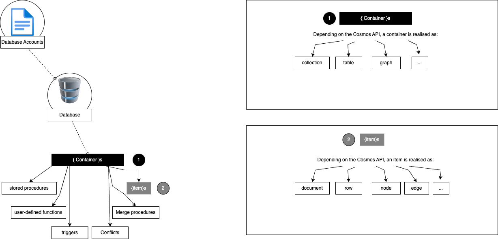
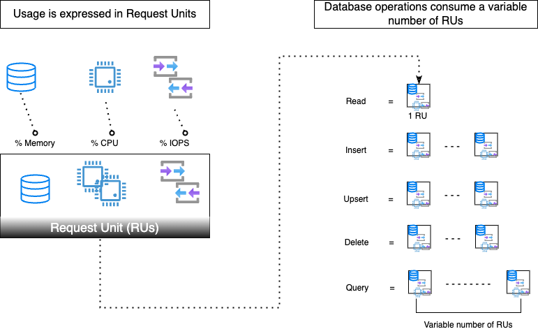
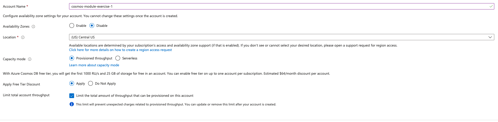
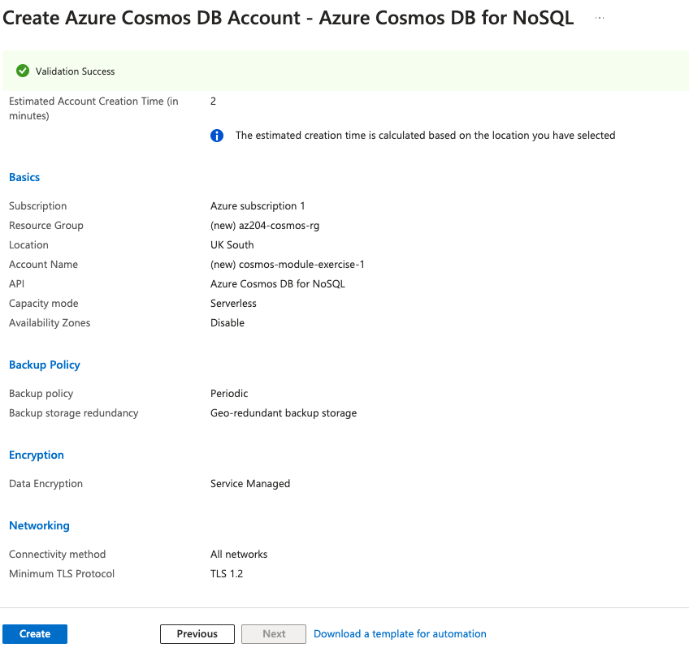
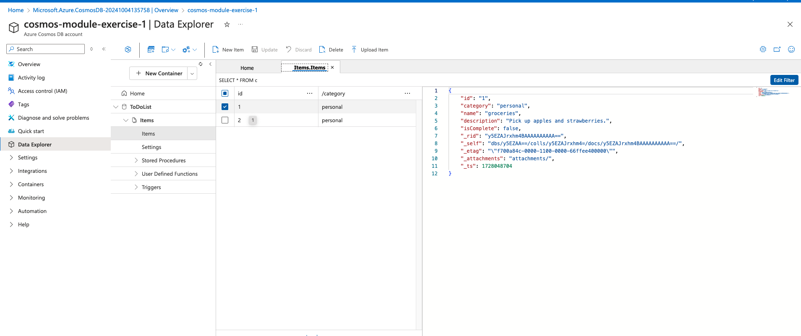

# Explore Azure Cosmos DB

This is a short course from Microsoft to help understand the basics of Azure Cosmos DB.

I'll have a sub-section for each chapter and chapter sub-sections within for my notes. Also, my notes include extra details to ensure I and whoever reads this document, properly understands the concepts.

The benefit of reading this document over the module is that the details are in one place and definitions and details are provided for some key terminology found throughout the module.

## Table Of Contents

[1. Introduction](#1-introduction)

[2. Identify Key Benefits of Azure Cosmos DB](#2-identify-key-benefits-of-azure-cosmos-db)

[2.1. Key benefits of global distribution](#21-key-benefits-of-global-distribution)

[3. Explore the resource hierarchy](#3-explore-the-resource-hierarchy)

[3.1. Elements in an Azure Cosmos DB Account](#31-elements-in-an-azure-cosmos-db-account)

[3.2. Azure Cosmos DB databases](#32-azure-cosmos-db-databases)

[3.3. Azure Cosmos DB containers](#33-azure-cosmos-db-containers)

[3.4. Azure Cosmos DB items](#34-azure-cosmos-db-items)

[4. Explore Consistency levels](#4-explore-consistency-levels)

[5. Choose the right consistency level](#5-choose-the-right-consistency-level)

[5.1. Configure the default consistency level](#51-configure-the-default-consistency-level)

[5.1.1. Remote client](#511-remote-client)

[5.1.2. Stored procedure](#512-stored-procedure)

[5.2. Guarantees associated with consistency levels](#52-guarantees-associated-with-consistency-levels)

[5.3. Strong consistency](#53-strong-consistency)

[5.4. Bounded staleness consistency](#54-bounded-staleness-consistency)

[5.5. Session Consistency](#55-session-consistency)

[5.6. Consistent prefix consistency](#56-consistent-prefix-consistency)

[5.7. Eventual consistency](#57-eventual-consistency)

[6. Explore supported APIs](#6-explore-supported-apis)

[6.1. Considerations when choosing an API](#61-considerations-when-choosing-an-api)

[6.2. API for NoSQL](#62-api-for-nosql)

[6.3. API for MongoDB](#63-api-for-mongodb)

[6.4. API for PostgreSQL](#64-api-for-postgresql)

[6.5. API for Apache Cassandra](#65-api-for-apache-cassandra)

[6.6. API for Apache Gremlin](#66-api-for-apache-gremlin)

[6.7. API for Table](#67-api-for-table)

[7. Discover request units](#7-discover-request-units)

[8. Exercise: Create Azure Cosmos DB resources by using the Azure portal](#8-exercise-create-azure-cosmos-db-resources-by-using-the-azure-portal)

## 1. Introduction

Azure Cosmos DB is a globally distributed database system that always allows you to read and write data from the local replicas of your database and it transparently replicates the data to all the regions associated with your Cosmos account.

The fact that in one sentence we use the words "globally" and "regions" can be confusing. This is because in the world of databases, a region is where, location wise, the data is stored, while a globally distributed database system refers to a database that spreads data across multiple databases, or shards, on different computers. Having the data spread across multiple databases (shards), allows for a single global database with data distributed across multiple regions.

The module aims to help us:

- Identify the key benefits provided by Azure Cosmos DB
- Describe the elements in an Azure Cosmos DB account and how they're organised
- Explain the different consistency levels and choose the correct one for your project
- Explore the APIs supported in Azure Cosmos DB and choose the appropriate API for your solution
- Describe how request units impact costs
- Create Azure Cosmos DB resources by using the Azure portal

All of the aims are useful for a lead data engineer, so let's move on and try to get familiar with the material in the module.

## 2. Identify key benefits of Azure Cosmos DB

Azure Cosmos DB is a fully managed NoSQL database designed to provide low latency, elastic scalability of throughput, well-defined semantics for data consistency, and high availability.

Since you can configure your databases to be globally distributed and available to any of the Azure regions, you can improve latency by placing the data close to where your users are.

With Azure Cosmos DB, you can add or remove the regions associated with your account at any time. Your application doesn't need to be paused or redeployed to add or remove a region.

So far, the descriptions above are what you expect from any good cloud based database system. I've worked with AWS in my previous project and the configurations described above are available on AWS too. That's all well and nice, but I think we need to define some of the terms found above.

Terms to define:

1. <u>Fully Managed Database:</u> A fully managed database is a database that is completely administered by the provider (in this case Azure). This means that using Azure Cosmos DB we won't have to monitor, manage, or maintain our own database saving us costs and time.
2. <u>NoSQL:</u>According to one of the most popular NoSQL databases, MongoDB, when people use the term "NoSQL database", they typically refer to any non-relational database. Some say the term "NoSQL" stands for "non-SQL" while others say it stands for "not only SQL". Either way, NoSQL, as opposed to SQL, is a database management approach, whereas SQL is just a query language, similar to the query languages of NoSQL databases. NoSQL databases come in different types. The four major types of NoSQL databases are:
    - Document Databases
    - Key-Value Databases
    - Wide-Column stores 
    - Graph databases
    - Bonus - Multi-model databases
    2.1. Azure Cosmos DB is the document database type.
3. <u>Latency:</u> is the interval of time between the request and response in a networked application. Think practically, how long will it take for your query to return results.
4. <u>Elastic Scalability of throughput:</u> Elastic scalability is the ability to automatically add or remove compute or networking infrastructure based on changing application traffic patterns. Throughput measures the overall performance of a system. For a database, this will be typically measured in transactions per second (TPS) or per minute (TPM). This means that elastic scalability of throughput, means that Cosmos DB will automatically change the number of compute or networking resources to improve throughput when needed, ensuring query performance, therefore, application performance.
5. <u>Semantics:</u> This refers to the semantics or meaning of the data. By knowing what the data means, it can help add context to the data, thereby improving the efficacy of data retrieval and analysis.
6. <u>High availability:</u> Availability means that the database downtime is limited.

### 2.1. Key benefits of global distribution

Azure Cosmos DB with its novel multi-master replication protocol, every region supports both writes and reads. the multi-master capability also enables:
- Unlimited elastic write and read scalability
- 99.999% read and write availability all around the world
- Guaranteed reads and writes served in less than 10 milliseconds at the 99th percentile

With the definitions provided in the previous section, the capabilities make more sense now, right?

Your application can perform near real-time reads and writes against all the regions you chose for your database. Azure Cosmos DB internally handles the data application between regions with consistency level guarantees of the level you selected.

Running a database in multiple regions worldwide increases the availability of a database. If one region is unavailable, other regions automatically handle application requests. Azure Cosmos DB offers 99.999% read and write availability for multi-region databases.
- This is good, but the issue here is that when you work with Central government clients such as TPX, you might not be able to use regions outside the UK. This means that you can take advantage of running a database in multiple regions worldwide only for the regions your data is "allowed" to be hosted in.

## 3. Explore the resource hierarchy

The Azure Cosmos DB account is the fundamental unit of global distribution and high availability. It contains a unique Domain Name System (DNS) name and you can manage an account by using one of the following tools: 
- Azure Portal 
- Azure CLI
- Language-Specific SDKs

You can add and remove Azure regions to your account at any time to globally distribute your data and throughput across multiple Azure regions.

### 3.1. Elements in an Azure Cosmos DB Account

Above we mentioned that the Azure Cosmos DB account is the fundamental unit of global distribution and high availability. An Azure Cosmos DB container is the fundamental unit of scalability. You can virtually have an unlimited provisioned throughput (RU/s) and storage on a container. 

Azure Cosmos DB transparently partitions your container using the logical partition key that you can specify in order to elastically scale your provisioned throughput and storage. From personal experience as a data practitioner in both engineering and science, the right partition strategy is important because done incorrectly or over-engineering it can lead to increased costs. However, done correctly, it can help improve performance.

Currently, you can create a maximum of 50 Azure Cosmos DB accounts under an Azure subscription (can be increased via support request). This doesn't influence the number of users that can use Azure Cosmos DB as there is no limit to the number of users that can access an Azure Cosmos DB account. After you create an account under your Azure subscription, you can manage the data in your account by creating databases, containers, and items. Each database in an Azure Cosmos DB account can have any number of users and users can be associated with an Azure Cosmos DB database. 

The following image, taken from the Microsoft Cosmos DB module, shows the hierarchy of different entities in an Azure Cosmos DB account:



### 3.2. Azure Cosmos DB databases

As we can see in the diagram, directly under the database accounts sits the database itself.

You can create one or multiple Azure Cosmos DB databases under your account. A database is analogous to a namespace. A database is the unit of management for a set of Azure Cosmos DB containers.

### 3.3. Azure Cosmos DB containers

An Azure Cosmos DB container is where data is stored. Unlike most relational databases, which scale up with larger sizes of virtual machines, Azure Cosmos DB scales out.

<strong><u>Scale up VS Scale out</strong></u>
Scale up and scale out are two different ways to scale data storage. Each has its own advantages and disadvantages.

<strong><u>Scale up:</strong></u>
Scale up is also known as vertical scaling, it is a method that adds more resources to an existing system such as more CPU, memory or disk space. It can be useful for handling spikes in workload, for example, on AWS Glue ETL projects you can use auto scaling to enable on-demand scaling up and scaling down of computing resources of your AWS Glue jobs which leads to using only what you need and avoiding over-spending.

<strong><u>Scale out:</strong></u>
Scale out is also known as horizontal scaling, it is a method that adds more components to a system, such as more replica pods or software nodes. For example, in a database, scale out involves installing additional database server instances.

Looking at the definitions, horizontal scaling is more expensive since we are creating more replica pods instead of increasing the size of one pod. Choosing the best solution is not purely based on price though. Since horizontal scaling is more expensive in the beginning but depending on the size of your data and business, you might want to bear that initial cost in favour for higher reliability and future-proofing since it's easier horizontally rather than vertically (vertical scaling has limitations).

Regardless of your preferences between scale up and scale out, Azure Cosmos DB doesn't give you a choice. If you choose to work with Azure Cosmos DB, then by default you are choosing to work with scale out (horizontal scaling).

Data in the Azure Cosmos DB containers is stored on one or more servers called partitions. To increase partitions, you increase throughput, or they grow automatically as storage increases. This relationship provides a virtually unlimited amount of throughput and storage for a container.

When you create a container, you need to supply a partition key. The partition key is a property that you select from your items to help Azure Cosmos DB distribute the data efficiently across partitions. From a data engineering perspective, the property should be a unique identification key as well. Azure Cosmos DB uses the value of this property to route data to the appropriate partition to be written, updated, or deleted. You can also use the partition key in the ```WHERE``` clause in queries for efficient data retrieval. 

The underlying storage mechanism for data in Azure Cosmos DB is called a physical partition. Physical partitions can have a throughput amount up to 10,000 Request Units per second, and they can store up to 50 GB of data. Azure Cosmos DB abstracts this partitioning concept with a logical partition, which can store up to 20 GB of data.

<u>When you create a container, you configure throughput in one of the following modes:</u>
- <strong>Dedicated throughput:</strong> The throughput on a container is exclusively reserved for the container. There are two types of dedicated throughput: standard and autoscale.
- <strong>Shared throughput:</strong> Throughput is specified at the database level and then shared with up to 25 containers within the database. Sharing of throughput excludes containers that are configured with their own dedicated throughput.

### 3.4. Azure Cosmos DB items

Depending on which API you use, individual data entities can be represented in various ways:

| <strong>Azure Cosmos DB entity</strong> | <strong>API for NoSQL</strong> | <strong>API for Cassandra</strong> | <strong>API for MongoDB</strong> | <strong>API for Gremlin</strong> | <strong>API for Table</strong> |
| --------------------------------------- | ------------------------------ | ---------------------------------- | -------------------------------- | -------------------- | ------------------------------ |
| Azure Cosmos DB item | Item | Row | Document | Node or edge | Item |

In terms of The Azure Cosmos DB API for NoSQL, the items are stored as JSON files.

## 4. Explore Consistency levels

Azure Cosmos DB approaches data consistency as a spectrum of choices instead of two extremes. Strong consistency and eventual consistency are at the ends of the spectrum, but there are many consistency choices along the spectrum. Developers can use these options to make precise choices and granular tradeoffs with respect to high availability and performance. 

Azure Cosmos DB offers five well-defined levels. From strongest to weakest4, the levels are:

- Strong
- Bounded staleness
- Session
- Consistent prefix
- Eventual

Each level provides availability and performance tradeoffs.

- Strong and bounded staleness have higher availability but also higher latency and lower throughput than the rest. 
- Session sits somewhere in the middle. 
- Consistent has lower availability, lower latency, and higher throughput than the previous three. 
- Eventual has the lowest availability, the lowest latency, and the highest throughput.

The consistency levels are region-agnostic and are guaranteed for all operations, regardless of:

- The region where the reads and writes are served
- The number of regions associated with your Azure Cosmos DB account
- Whether your account is configured with a single or multiple write regions

Read consistency applies to a single read operation scoped within a partition-key range or a logical partition.

<em>Understanding the difference between partition-key range and logical partition might be useful when we want to decide the behaviour of our Cosmos DB read operations. [Further reading](https://learn.microsoft.com/en-us/azure/cosmos-db/partitioning-overview) could be useful</em>

## 5. Choose the right consistency level

Each of the consistency models can be used for specific real-world scenarios. Each provides precise availability and performance tradeoffs backed by comprehensive Service Level Agreements (SLAs). SLAs for Azure Cosmos DB are guarantees for the performance of the database service. SLAs are common in the cloud computing services providers such as Azure and AWS.

Per Azure Cosmos DB, the following considerations help you make the right consistency model choice in many common scenarios.

### 5.1. Configure the default consistency level

You can configure the default consistency level on your Azure Cosmos DB account at any time. The default consistency level configured on your account applies to all Azure Cosmos DB databases and containers under that account. All reads and queries issued against a container or a database use the specified consistency level by default.

Read consistency applies to a single read operation scoped within a logical partition. The read operation can be issued by a remote client or a stored procedure.

#### 5.1.1. Remote client

Above we mention that the read operation can be issued by a remote client or a stored procedure. It's a fair question to ask, what is a remote client?

A CosmosClient is part of the Azure Cosmos DB SDK for SQL API. A remote client for Azure Cosmos DB is a client that can configure and execute requests in the Azure Cosmos DB database service.

#### 5.1.2. Stored procedure

Following the same logic as earlier on, we need to ask, what is a stored procedure?

A stored procedure is a server-side program that executes business logic in JavaScript to perform database operations.

Stored procedures can: 
- create, update, read, query, and delete items in an Azure Cosmos DB container.
- perform basic CRUD (create, read, update, delete) operations on multiple documents within a single transaction scope

Stored procedures are registered per collection and can operate on any document or attachment in that collection. <em>A collection is a container of JSON documents and associated JavaScript application logic, i.e., stored procedures, triggers, and user-defined functions ([source](https://learn.microsoft.com/en-us/rest/api/cosmos-db/collections)).</em> They are executed within a logical partition key and a logical partition key value must be provided during execution.

Stored procedures are written in JavaScript using the server-side JavaScript SDK for Azure Cosmos DB.

Why use stored procedures? The benefits are that stored procedures can enhance database security, modularity, and code reusability. They can also implement uint of business logic, and all write operations are committed if the stored procedure runs successfully to completion.

### 5.2. Guarantees associated with consistency levels

Azure Cosmos DB guarantees that 100 percent of read requests meet the consistency guarantee for the consistency level chosen. The precise definitions of the five consistency levels in Azure Cosmos DB using the TLA + specification language are provided in the [azure-cosmos-tla](https://github.com/Azure/azure-cosmos-tla) GitHub repo. As a reminder, we have explored the consistency levels in the [Explore Consistency levels](#4-explore-consistency-levels) section of the document but there is a nice table in the GitHub repo that I'll add here for extra context.

| <strong>Consistency Level</strong> | <strong>Guarantees</strong> |
| ---------------------------------- | --------------------------- |
| Strong | Linearizable reads |
| Bounded Staleness | Consistent Prefix. Reads lag behind writes by k prefixes or t interval |
| Session | Consistent Prefix. Monotonic reads, monotonic writes, read-your-writes, write-follows-reads |
| Consistent Prefix | Updates returned are some prefix of all the updates, with no gaps |
| Eventual | Eventual |

The recommended way to understand/define consistency precisely is mathematically. The engineers at Cosmos DB used TLA+ specification language to specify the consistency guarantees precisely. The TLA+, developed by the Cosmos DB engineers, is a nested multilayered implementation of the [Paxos consensus algorithm](https://www.scylladb.com/glossary/paxos-consensus-algorithm/).

### 5.3. Strong consistency

Strong consistency offers a linearizability guarantee. Linearizability refers to serving requests concurrently. the reads are guaranteed to return the most recent committed version of an item. A client never sees an uncommitted or partial write. Users are always guaranteed to read the latest committed write.

### 5.4. Bounded staleness consistency

In bounded staleness consistency, the lag of data between any two regions is always less than a specified amount. The amount can be "K" versions (that is, "updates"), of an item or by "T" time intervals, whichever is reached first. When you choose bounded staleness, the maximum "staleness" of the data in any region can be configured in two ways:
- The number of versions (K) of the item
- The time interval (T) reads might lag behind the writes

Bounded Staleness is beneficial primarily to single-region write accounts with two or more regions. If the data lag in a region (determined per physical partition) exceeds the configuration staleness value, writes for that partition are throttled until staleness is back within the configured upper bound.

For a single-region, Bounded Staleness provides the same write consistency guarantees as Session and Eventual Consistency. With Bounded Staleness, data is replicated to a local majority (three replicas in a four replica set) in the single region.

### 5.5. Session Consistency

In session consistency, within a single client session, reads are guaranteed to honor the read-your-writes, and write-follows-reads guarantees. This guarantee assumes a single "writer" session or sharing the session token for multiple writers.

Like all consistency levels weaker than Strong, writes are replicated to a minimum of three replicas (in a four replica set) in the local region, with asynchronous replication to all other regions.

### 5.6. Consistent prefix consistency

In consistent prefix, updates made as single document writes see eventual consistency. Updates made as a batch within a transaction, are returned consistent to the transaction in which they were committed. Write operations within a transaction of multiple documents are always visible together.

Assume two write operations are performed on documents Doc 1 and Doc 2, within transactions T1 and T2. When client does a read in any replica, the user sees either "Doc 1 v1 and Doc 2 v1" or "Doc 1 v2 and Doc2 v2", but never "Doc 1 v1 and Doc 2 v2" or "Doc 1 v2 and Doc2 v1" for the same read or query operation.

### 5.7. Eventual consistency

In eventual consistency, there's no ordering guarantee for reads. In the absence of any further writes, the replicas eventually converge.

Eventual consistency is the weakest form of consistency because a client might read the values that are older than the ones in read before. Eventual consistency is ideal where the application doesn't require any ordering guarantees. Examples include count of Retweets, Likes or non-threaded comments.

## 6. Explore supported APIs

Azure Cosmos DB offers multiple database APIs, which include NoSQL, MongoDB, PostgreSQL, Cassandra, Gremlin, and Table. We created a table in the [Azure Cosmos DB Items](#34-azure-cosmos-db-items) section of the document with the APIs list. Here we are going to explore those APIs in more detail.

By using these APIs, you can model real world data using documents, key-value, graph, and column-family data models. These APIs allow your application to treat Azure Cosmos DB as if it were various other databases technologies, without the overhead of management, and scaling approaches. Azure Cosmos DB helps you to use the ecosystem, tools, and skills you already have for data modeling and querying with its various APIs.

All the APIs offer automatic scaling of storage and throughput, flexibility, and performance guarantees. There's no one best API, and you may choose any one of the APIs to build your application.

For people who come from the AWS ecosystem, this is similar to how AWS offers fully managed graph APIs through [Amazon Neptune](https://aws.amazon.com/neptune/?p=ft&c=db&z=3) and relational database APIs through [Amazon RDS](https://aws.amazon.com/rds/?p=ft&c=db&z=3).

Since at the time of writing, the project of interest is using The Cosmos DB API for NoSQL, we won't be writing any details for the APIs other than what is written in the module. The benefit of reading this document over the module is that the details are in one place and definitions and details are provided for some key terminology found throughout the module.

### 6.1. Considerations when choosing an API

API for NoSQL is native to Azure Cosmos DB.

API for MongoDB, PostgreSQL, Cassandra, Gremlin, and Table implement the wire protocol of open-source database engines. These APIs are best suited if the following conditions are true:

- If you have existing MongoDB, PostgreSQL, Cassandra, or Gremlin applications
- If you don't want to rewrite your entire data access layer
- If you want to use the open-source developer ecosystem, client-drivers, expertise, and resources for your database

If you are building a new project and you know that you are going to use Cosmos DB long-term, it is recommended that you use the native API for NoSQL.

### 6.2. API for NoSQL

The Azure Cosmos DB API for NoSQL stores data in document format. It offers the best end-to-end experience as Azure Cosmos DB has full control over the interface, service, and the SDK client libraries. Any new feature that is rolled out to Azure Cosmos DB is first available on API for NoSQL accounts. NoSQL accounts provide support for querying items using the Structured Query Language (SQL) syntax.

Azure Cosmos DB saves documents in JSON so it is recommended to read on [modeling-data](https://learn.microsoft.com/en-gb/azure/cosmos-db/nosql/modeling-data) if you are planning to use the API for NoSQL.

### 6.3. API for MongoDB

The Azure Cosmos DB API for MongoDB stores data in a document structure, via BSON format. BSON, or Binary JSON, is a binary format for representing data structures, such as arrays and scalar types. It's a lightweight, fast-to-encode-and-decode format that's similar to JSON, but with some key differences. It's compatible with MongoDB wire protocol; however, it doesn't use any native MongoDB related code. The API for MongoDB is a great choice if you want to use the broader MongoDB ecosystem and skills, without compromising on using Azure Cosmos DB features.

### 6.4. API for PostgreSQL

Azure Cosmos DB for PostgreSQL is a managed service for running PostgreSQL at any scale, with the [Citus open source](https://github.com/citusdata/citus) superpower of distributed tables. It stores data either on a single node, or distributed in a multi-node configuration.

You can read on Citus by following the link above, but in summary, Citus is a PostgreSQL extension that transforms Postgres into a distributed database to help achieve high performance at scale.

### 6.5. API for Apache Cassandra

The Azure Cosmos DB API for Cassandra stores data in column-oriented schema. Apache Cassandra offers a highly distributed, horizontally scaling approach to storing large volumes of data while offering a flexible approach to a column-oriented schema. API for Cassandra in Azure Cosmos DB aligns with this philosophy to approaching distributed NoSQL databases. This API for Cassandra is wire protocol compatible with native Apache Cassandra.

### 6.6. API for Apache Gremlin

The Azure Cosmos DB for Gremlin allows users to make graph queries and stores data as edges and vertices.

use the API for Gremlin for scenarios:

- Involving dynamic data
- Involving data with complex relations
- Involving data that is too complex to be modeled with relational databases
- If you want to use the existing Gremlin ecosystem and skills

### 6.7. API for Table

The Azure Cosmos DB API for Table stores data in key/value format. If you're currently using Azure Table storage, you might see some limitations in latency, scaling, throughput, global distribution, index management, and low query performance. The API for Table overcomes these limitations and the recommendation is to migrate your app if you want to use the benefits of Azure Cosmos DB. API for Table only supports Online Transaction Processing (OLTP) scenarios. OLTP is a data processing method that involves executing multiple methods at the same time. Some examples of OLTP scenarios include online banking, shopping, order entry, and sending text messages.

## 7. Discover request units

with Azure Cosmos DB, you pay for the throughput you provision and the storage you consume on an hourly basis. Throughput must be provisioned to ensure that sufficient system resources are available for your Azure Cosmos database always.

The cost of all database operations is normalised in Azure Cosmos DB and expressed by request units (or RUs, for short). A request unit represents the system resources such as CPU, Input/Output Operations Per Second (IOPS), and memory that are required to perform the database operations supported by Azure Cosmos DB.

Again, if you are familiar with the AWS world, when you run an ETL job in AWS Glue, you are charged based on the Data Processing Units (DPUs) per hour. There are key differences in how DPU-Hour and RUs costs are calculated, but this document/post is focused on Azure Cosmos DB, therefore we are going to explore the RUs further. If you do want to read on [AWS pricing, read here](https://aws.amazon.com/glue/pricing/).

The cost to do a point read, which is fetching a single item by its ID and partition key value, for a 1-KB item is 1RU. All other database operations are similarly assigned a cost using RUs. No matter which API you use to interact with your Azure Cosmos container, costs are measured by RUs. Whether the database operation is a write, point read, or query, costs are measured in RUs.

The module provides a high-level example infographic to try and visualise how an operation consumes RUs. Although is a nice visual, I don't think is the best way to understand it, therefore, below the visual, we will explore this [metric definition](https://learn.microsoft.com/en-us/azure/cosmos-db/monitor-normalized-request-units).



The type of Azure Cosmos DB account you're using determines the way consumed RUs get charged. There are three modes in which you can create an account.

- <strong>Provisioned throughput mode:</strong> In this mode, you provision the number of RUs for your application on a per-second basis in increments of 100 RUs per second. To scale the provisioned throughput for your application, you can increase or decrease the number of RUs at any time in increments or decrements of 100 RUs. You can make your changes either programmatically or by using the Azure portal. You can provision throughput at container and database granularity level.

- <strong>Serverless mode:</strong> In this mode, you don't have to provision any throughput when creating resources in your Azure Cosmos DB account. At the end of your billing period, you get billed for the number of request units that have been consumed by your database operation.

- <strong>Autoscale mode:</strong> In this mode, you can automatically and instantly scale the throughput (RU/s) of your database or container based on its usage. This scaling operation doesn't affect the availability, latency, throughput, or performance of the workload. This mode is well suited for mission-critical workloads that have variable or unpredictable traffic patterns, and require SLAs on high performance and scale.

Something that is not very clear in the module but it is important to note, the normalised RU Consumption means that when data is partitioned within a container, the overall normalised RU consumption of the entire container will be the "MAX" utilisation across the containers. The paragraph below is taken directly from [here](https://learn.microsoft.com/en-us/azure/cosmos-db/monitor-normalized-request-units) and it makes it easy to understand this point.

<em>For example, suppose you have a container where you set autoscale max throughput of 20,000 RU/s (scales between 2000 - 20,000 RU/s) and you have two partition key ranges (physical partitions) P1 and P2. Because Azure Cosmos DB distributes the provisioned throughput equally across all the partition key ranges, P1 and P2 each can scale between 1000 - 10,000 RU/s. Suppose in a 1 minute interval, in a given second, P1 consumed 6000 request units and P2 consumed 8000 request units. The normalized RU consumption of P1 is 60% and 80% for P2. The overall normalized RU consumption of the entire container is MAX(60%, 80%) = 80%.</em>

## 8. Exercise: Create Azure Cosmos DB resources by using the Azure portal

During this exercise I came to understand that there are only two available zones on the free trial subscription.

I also came to learn that there are only two capacity modes available to select from when working with the free trial settings:
- Provision throughput
- Serveless

I'm not sure if the capacity modes are influenced by the regions.

Serveless doesn't give you the option for further settings, which makes sense as we described earlier on in the [discover request units](#7-discover-request-units) section, the serverless mode doesn't need you to provision any throughput when cerating the resources.

On the other hand, the Provision throughput option, as you can see in the screenshot below, it allows you to limit the total account throughput. I'm not sure if there are more options when you have an account that it's not "free tier". In the future, I'll be using a full account for a real-life project and try to write a lessons-learned document/post.



For the exercise we are choosing the ```Serveless``` capacity mode. 

Below we can see the setup I went with for this tutorial. I am based in London so I chose UK South location. It is recommended that you use the location closest to the user. In this scenario I am both the user and the developer.



After creating the resource, we explored the functionality of adding new data to our Cosmos DB instance.



The exciting thing is how simple it is to do so. Simply create an ew item and fill in the JSON key-value pairs. In the example screenshot above, I manually entered the below:

```json
{
    "id": "1",
    "category": "personal",
    "name": "groceries",
    "description": "Pick up apples and strawberries.",
    "isComplete": false
}
```

Upon saving, the Data Explorer tool added the metadata:

```json
{
    "_rid": "y5EZAJrxhm4BAAAAAAAAAA==",
    "_self": "dbs/y5EZAA==/colls/y5EZAJrxhm4=/docs/y5EZAJrxhm4BAAAAAAAAAA==/",
    "_etag": "\"f700a84c-0000-1100-0000-66ffee400000\"",
    "_attachments": "attachments/",
    "_ts": 1728048704
}
```
