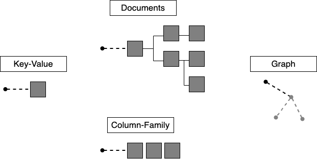
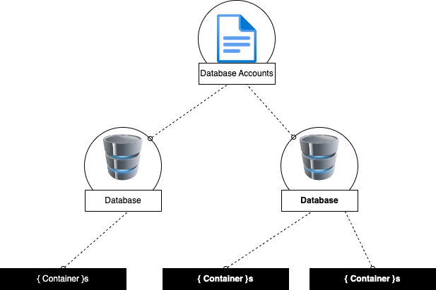
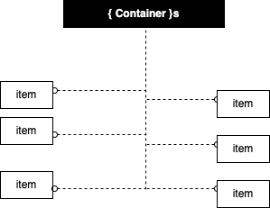
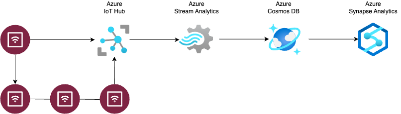
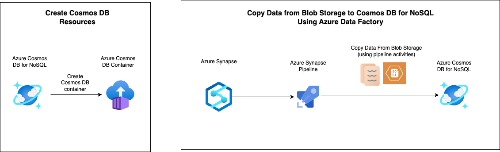

# Introduction to Cosmos DB for NoSQL

Modern apps thrive on real-time data from different sources, shaped in different forms. An app's usefulness is often in its ability to move and use data.

Azure Cosmos DB is a fast NoSQL database service for modern app development at any scale.

During this module we are going to look at how Azure Cosmos DB and its NoSQL API can be used  for this type of business problem. We also learn a bit about how the database works.

After completion we should be able to:
- Evaluate whether Azure Cosmos DB for NoSQL is the right database for our application
- Describe how the features of the Azure Cosmos DB for NoSQL are appropriate for modern applications

## What is Azure Cosmos DB NoSQL

Developers require new kinds of databases that can address the unique challenges of modern apps. NoSQL databases were designed to address needs such as:
- High volumes of data
- Data with many different sources and forms
- Dynamic data schemas that store different types of data
- Using high-velocity and/or real-time data

You define NoSQL databases by the common characteristics they share rather than by a specific formal definition. These characteristics include:
- A non-relational data store
- Being designed to scale out
- Not enforcing a specific schema

Generally, NoSQL databases don't enforce relational constraints or put locks on data, making writes fast. Also, they're often designed to horizontally scale via sharding or partitioning, which allows them to maintain high-performance regardless of size.

While there are many NoSQL data models, four broad data model families are commonly used when modeling data in a NoSQL database:



The data model supported by Cosmos DB NoSQL is the <strong><em>document data model</strong></em>

## Why use a NoSQL database with document data model?

The document data model breaks data down into individual <strong>document</strong> entities. A document can be any structured data type, but JSON is commonly used as the data format. The Azure Cosmos DB for NoSQL supports JSON natively.

A document is an atomic entity and can have its own data form, regardless of what is stored in other documents in the same database. Because of this flexibility, there's no need for a predefined schema making it easier to build new applications rapidly. 

Additionally, this flexibility enables scenarios where different types of data can be stored together and where models can evolve over the lifetime of an application.

## What is a JSON document?

JavaScript Object Notation, or JSON, is a lightweight data format. JSON was built to be highly compatible with the literal notation of an object in the JavaScript language. Many frameworks, browsers, and even databases support JavaScript natively making JSON a popular format for transmitting and storing data.

Here's an example of a JSON document:

```json
{
  "device": {
    "type": "mobile"
  },
  "sentTime": "2019-11-12T13:08:42",
  "spoolRefs": [
    "6a86682c-be5a-4a4a-bacd-96c4d1c7ece6",
    "79e78fe2-93aa-4688-89db-a7278b034aa6"
  ]
}
```

JSON is a relatively readable data format that clearly exposes its content. JSON is also relatively easy to parse and use in JavaScript applications.

## What is Azure Cosmos DB for NoSQL?

Azure Cosmos DB for NoSQL is a fast NoSQL database service that offers rich querying over diverse data. It helps deliver configurable and reliable performance, is globally distributed, and enables rapid development.

The NoSQL API is the core or native API for working with documents. The NoSQL API supports fast, flexible development utilizing JSON documents, a query language with a familiar syntax, and client libraries for popular programming languages. 

Azure Cosmos DB provides APIs, such as Mongo, Gremlin, and Cassandra. These APIs offer compatibility with each database ecosystem, while still mapping to the same underlying infrastructure of the native NoSQL API.

Azure Cosmos DB for NoSQL has a few advantages such as:
- <strong>Guaranteed speed at any scale</strong> -  even though bursts - with instant, limitless elasticity, fast reads, and multi-master writes, anywhere in the world.
- <strong>Fast, flexible app development</strong> with SDKs for popular languages, a native NoSQL API along with APIs for MongoDB, Cassandra, and Gremlin, and no-ETL (extract, transform, load) analytics.
- <strong>Ready for mission-critical applications</strong> with guaranteed business continuity, 99.999% availability, and enterprise-grade security.
- <strong>Fully managed and cost-effective serverless database</strong> with instant, automatic scaling that responds to application needs.

The above capabilities make Azure Cosmos DB ideally suited for modern application development. Azure Cosmos DB for NoSQL is especially suited for applications that:
- Experience unpredictable spikes and dips in traffic
- Generate lots of data
- Need to deliver real-time user experiences
- Are depended upon for business continuity

The Azure Cosmos DB for NoSQL can arbitrarily store native JSON documents with flexible schema. Data is indexed automatically and is available for query using a flavor of the SQL query language designed for JSON data. The NoSQL API can be accessed using SDKs for popular frameworks such as .NET, Python, Java, and Node.JS.

### What is No-ETL Analytics?

No-ETL analytics, also known as Zero-ETL, is a data integration method that allows users to analyse data directly from its source without the need for traditional extract, transform, and load (ETL) processes.

## How does Azure Cosmos DB for NoSQL work

### What are the components of Azure Cosmos DB for NoSQL?

To begin using Azure Cosmos DB, you first create various resources in Azure such as accounts, databases, containers, and items.



As we noted in the introduction to Azure Cosmos DB, let's quickly summarise what each resource is and does:

#### Accounts

Accounts are the fundamental units of distribution and high availability. At the account level, you can configure the region[s] for your data in Azure Cosmos DB for NoSQL. Accounts also contain the globally unique DNS name used for API requests. You can also set the default consistency level for requests at the account level. You can manage or create accounts using the Azure portal, Azure Resource Manager templates, the Azure CLI, or Azure PowerShell.

#### Databases

Each account can contain one or more Databases. A database is a logical unit of management for containers in Azure Cosmos DB for NoSQL.

#### Containers

Containers are the fundamental unit of scalability in Azure Cosmos DB for NoSQL. With Azure Cosmos DB, you provision throughput ([a definition of throughput can be found here](https://medium.com/road-to-full-stack-data-science/introduction-to-azure-cosmos-db-high-519898f0d211#:~:text=Throughput%20measures%20the%20overall%20performance%20of%20a%20system.%20For%20a%20database%2C%20this%20will%20be%20typically%20measured%20in%20transactions%20per%20second%20(TPS)%20or%20per%20minute%20(TPM))) at the container level. You can also optionally configure an indexing policy or a default time-to-live value at the container level. Azure Cosmos DB for NoSQL will automatically and transparently partition the data in a container.

#### Items

The NoSQL API for Azure Cosmos DB stores individual documents in JSON format as items within the container. Azure Cosmos DB for NoSQL natively supports JSON files and can provide fast and predictable performance because write operations on JSON documents are atomic. Atomic, means that each document can be written exclusively to avoid errors from simultaneous writes.



### Partitioning and Partition Keys

Every Azure Cosmos DB for NoSQL container is required to specify a <strong>partition key path</strong>. This path is used by Cosmos DB for NoSQL behind the scenes to logically partition data using <strong>partition key values</strong>.

Since Cosmos DB stores data in virtual buckets called virtual partitions, it relies on the partition key to determent which of these buckets to put data in and where to look for data during a query.

<em>Selecting a partition key path for a container can be one of the most important design decisions for a new workload. The [choosing a partition key documentation](https://learn.microsoft.com/en-us/azure/cosmos-db/partitioning-overview#choose-partitionkey) can be useful for when we are ready to select our partition key. In the meantime, we can remember the 3 guidelines below</em>

When choosing a key, we should start by testing our most important requests against 3 guidelines:

1. Find the right balance:
    
    1.1. Test the partition key to see how it distributes writes. We want to avoid hotspots and rate limits by achieving event distribution of throughput and storage across logical partitions.

2. Aim for a single partition query:

    2.1. Check, how many partitions get hit when you run your most frequent queries. 
    2.2. We want to avoid the cost and latency of involving multiple partitions, by choosing a key that queries a single partition.

3. Understand cross-partition query trade-offs:

    3.1. If you run cross-partition queries for less important workloads every once in a while, it won't impact your overall experience.
    3.2. If it's more than that, you can use an array of descrete values for the partition keys in your query to target a subset of partitions. For example:
    ```SQL
    SELECT * FROM c WHERE c.cityname = IN ('Los Angeles', 'Toronto')

    // Where partition key is the cityname and the descrete values are the names of the cities.
    ```

#### Partition Key Value in Practice

The module has a nice JSON example to showcase this in practice. Think of the JSON document below:

```JSON
{
  "id": "35b5bf7d-5f0e-4209-b7cb-8c5c70c3bb59",
  "deviceDisplayName": "shared-printer",
  "acquiredYear": 2019,
  "department": {
    "name": "information-technology",
    "metadata": {
      "location": "floor-5-unit-27"
    }
  },
  "queuedDocuments": [
    {
      "sender": "user-293749329",
      "sentTime": "2019-07-26T05:12:37",
      "pages": 5,
      "spoolRef": "3f4b759c-3230-4269-a88e-de7620ad91c0"
    },
    {
      "device": {
        "type": "mobile"
      },
      "sentTime": "2019-11-12T13:08:42",
      "spoolRefs": [
        "6a86682c-be5a-4a4a-bacd-96c4d1c7ece6",
        "79e78fe2-93aa-4688-89db-a7278b034aa6"
      ]
    }
  ]
}
```

If we define the ```department/name``` as the partition key <strong>path</strong>, then the partition key <strong>value</strong> of this document would be  ```information-technology```. 

### When should you use Azure Cosmos DB for NoSQL

Taken directly from the module:

<em>Azure Cosmos DB for NoSQL is a fully managed NoSQL database service for modern app development. It provides guaranteed single-digit millisecond response times and 99.999-percent availability, backed by Service Level Agreements (SLAs) with automatic and instant scalability.</em>

#### Common use cases for Azure Cosmos DB for NoSQL

Speed and flexibility make Azure Cosmos DB for NoSQL great for web, retail, IoT, gaming, and mobile applications. Azure Cosmos DB for NoSQL is a good fit for applications that require flexibility, low response time, and transactions at massive volume or velocity.

#### IoT/Telemetry

IoT sensor loads can be diverse and unpredictable. These workloads need a database platform that is responsive and capable of elastic scale to meet the needs of as many, or as few, data collection devices deployed at any point in time.

Since IoT workloads can also write massive volumes of data, a write-optimised database is beneficial. 

Azure Cosmos DB for NoSQL is optimised for write-heavy workloads. Operations on a single document are atomic with fast and predictable indexed write speeds. 

Azure Cosmos DB for NoSQL is globally distributed and elastic to help meet thee needs of various IoT workloads.



In the example provided above, a growing number of IoT devices are sending sensor data to an Azure IoT Hub. Azure Stream Analytics then ingests and aggregates the data for storage in Azure Cosmos DB for NoSQL. Azure Synapse Analytics then performs near real-time analysis over the data using [Azure Synapse Link for Azure Cosmos DB](https://learn.microsoft.com/en-us/azure/cosmos-db/synapse-link)

That's a nice example but what if we have to copy data from a blob storage to Cosmos DB? I think to achieve that we can use the Azure Synapse Pipeline to do just that (see the diagram below for an example).



