# Try Azure Cosmos DB for NoSQL

The theory is nice, but in this module, we'll create a Cosmos DB account, database and container for Azure Cosmos DB for NoSQL.

## Introduction

The first step to getting started with Azure Cosmos DB is to create an account. This module will teach us how to:
- Create a new Azure Cosmos DB for NoSQL account
- Create a database, container, and item resources for an Azure Cosmos DB for NoSQL account.

## Explore resources

As we already touched upon, an Azure Cosmos DB for NoSQL account is composed of a basic hierarchy of resources that include:

- An account
- One or more databases
- One or more containers
- Many items

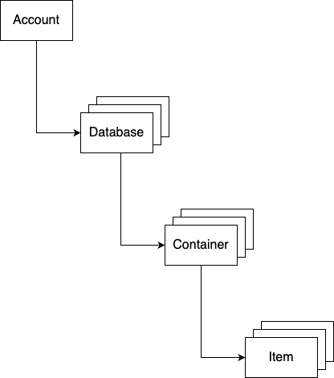

Let's explore each item in the hierarchy individually.

## Account

Each tenant of the Azure Cosmos DB service is created by provisioning a database account. Accounts are the fundamental units of data distribution, high availability and security. At the account level, you can configure the region[s] for your data in Azure Cosmos DB for NoSQL. Accounts also contain the globally unique DNS name used for API requests.

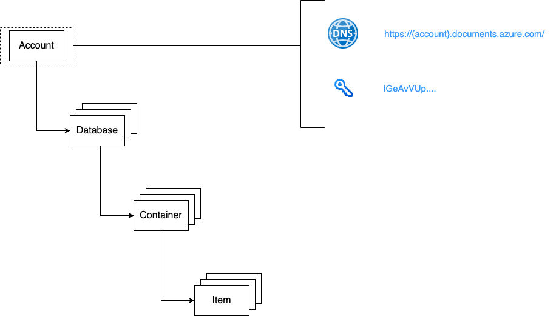

## Database

A database is a logical unit of management for containers in Azure Cosmos DB for NoSQL. Within a database, you can find one or more containers.

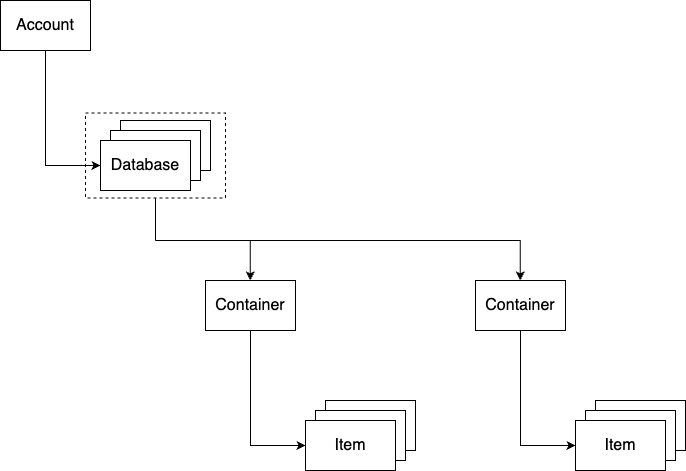

## Container

Containers are the fundamental unit of scalability in Azure Cosmos DB for NoSQL. Typically, you provision throughput at the container level but you can use Serverless as well. Azure Cosmos DB for NoSQL will automatically and transparently partition the data in a container using the document property you select as a partition key for the container. You can also optionally configure indexing policies or a default time-to-live value at the container level.

<strong><em>Indexing Policies:</em></strong> 

In Azure Cosmos DB, every container has an indexing policy that dictates how the container's items should be indexed. The default indexing policy for newly created containers indexes every property of every item and enforces range indexes for any string or number. According to Microsoft, this allows you to get good query performance without having to think about indexing and index management upfront. 

In some situations, you might want to override this automatic behavior to better suit your requirements. You can customise a container's indexing policy by setting its indexing mode, and include or exclude property paths. [Read more here](https://learn.microsoft.com/en-us/azure/cosmos-db/index-policy)

<strong><em>Time-to-live Value:</em></strong> 

The time-to-live value is set in seconds, and is interpreted as a delta from the time that an item was last modified. You can set time to live on a container or an item within the container:

1. <strong>Time to Live on a container</strong> (set using DefaultTimeToLive):
    - If missing (or set to null), items aren't expired automatically.
    - If present and the value is set to "-1," it's equal to infinity, and items don't expire by default.
    - If present and the value is set to some nonzero number "n," items will expire "n" seconds after their last modified time.

2. <strong>Time to Live on an item</strong> (set using ```ttl```):
    - This Property is applicable only if ```DefaultTimeToLive``` is present and it isn't set to null for the parent container.
    - If present, it overrides the ```DefaultTimeToLive``` value of the parent container.

[Read here for more information on Time to Live configurations](https://learn.microsoft.com/en-us/azure/cosmos-db/nosql/time-to-live)

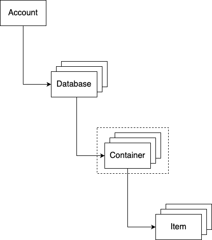

## Item[s]

An Azure Cosmos DB for NoSQL resource container is a schema-agnostic container of arbitrary user-generated JSON items. The NoSQL API for Azure Cosmos DB stores individual documents in JSON format as items within the container. Azure Cosmos DB for NoSQL natively supports JSON files and can provide fast and predictable performance because write operations on JSON documents are atomic.

<em>Containers can also store JavaScript based stored procedures, triggers and user-defined-functions (UDFs).</em>

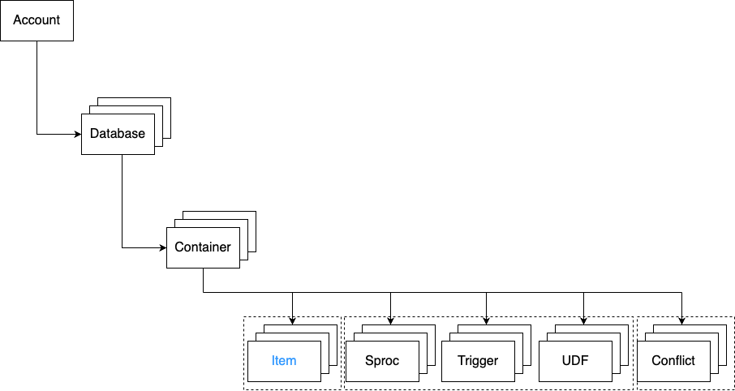

## High-level explanation of resources creation

Here we are going to explain the different settings we need to keep in mind for when we create the account, database, container, and item[s] resources in Azure Cosmos DB. After that, we are going to create them.

### Account creation

When creating an account we are going to use the step-by-step wizard.

Here we can configure options such as:
- The globally unique name of your account
- The location (Azure region) for the account
- Capacity mode (provisioned throughput or serverless)

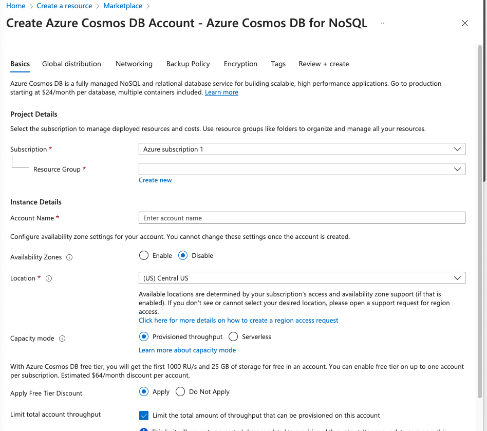

It's good to know that only the options in the <strong>Basics</strong> tab are required to create an Azure Cosmos DB account.

### Database Creation

Databases don't require much to create. We only need a unique database name within the account to create a new database.

<em><strong>Note:</strong>

If we choose to provision throughput at the database level, configuring the database may require additional steps. At the time of writing, I would suggest that we shouldn't provision throughput on the database level, we should do it on the account level, except if we have a very specific use-case that requires us to do it on the database level</em>

### Container creation

Containers are important since they are the primary unit of scalability in Azure Cosmos DB for NoSQL. When creating a container, we should specify:

- The parent database
- A unique name for the container with the database
- The path for the partition key value
- <em>Optional:</em> provisioned throughput if not using a Serverless account.

As we mentioned before in the document, the Azure Cosmos DB service will automatically and transparently partition our data based on the value of the partition key for each individual item.

### Simple Items creation

Once we have our database and container resources, we can now create our first item. In Azure Cosmos DB for NoSQL, an item is a JSON document.

An example JSON document that could be an item in an Azure Cosmos DB account:

```JSON
{
  "id": "0012D555-C7DE",
  "type": "customer",
  "fullName": "Franklin Ye",
  "title": null,
  "emailAddress": "fye@cosmic.works",
  "creationDate": "2014-02-05",
  "addresses": [
    {
      "addressLine": "1796 Westbury Drive",
      "cityStateZip": "Melton, VIC 3337 AU"
    },
    {
      "addressLine": "9505 Hargate Court",
      "cityStateZip": "Bellflower, CA 90706 US"
    }
  ],
  "password": {
    "hash": "GQF7qjEgMk=",
    "salt": "12C0F5A5"
  },
  "salesOrderCount": 2
}
```

## Create the resources

Now we are ready to create the resources for Cosmos DB for NoSQL. We are going to create an account, a database, a container, and a few simple items.

### Create Account, Container & Database

In the module you won't walk through how to set it up step by step, but since I am new to the Azure ecosystem, I think it's helpful to have the guide starting from the Azure portal homepage. As you can see in the screenshot below, you have a few options, but I would recommend clicking on ```Create a resource``` button.

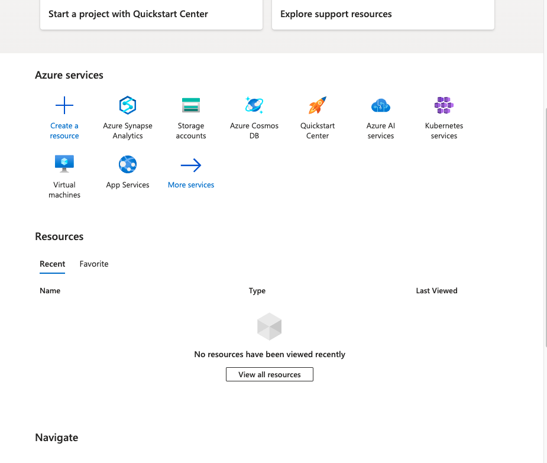

The next step is to search for the Azure Cosmos DB resource and click create.

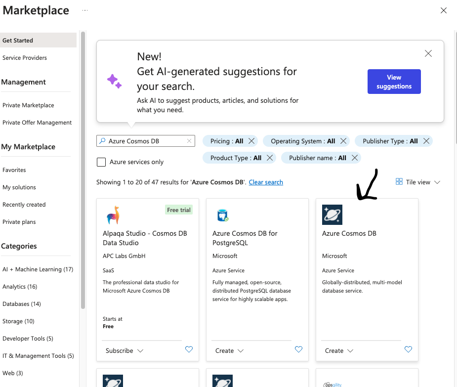

The next step is as the module suggests, we are going to select our API, depending on your account, you are going to have different options. I am using the free trial at the time of writing this so I get only two options, ```Azure Cosmos DB for NoSQL``` and ```Azure Cosmos DB for MongoDB```. The rest of the APIs seem to need a full account. For the purposes of this document, we are going to create an Azure Cosmos DB for NoSQL account.

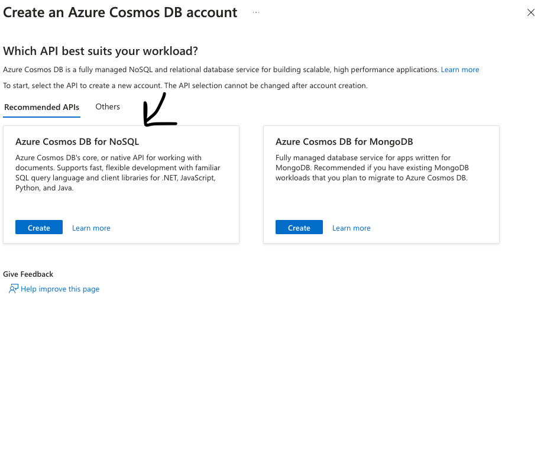

The next step, once we click create, we will be greeted with a step-by-step wizard with tabs for various configuration options.

The Basics tab setup is as bellow:

| <strong>Setting</strong> | <strong>Value</strong> |
|--------------------------|------------------------|
| <strong>Subscription</strong> | <strong>Use your existing Azure subscription.</strong> All resources must belong to a resource group. Every resource group must belong to a subscription. |
| <strong>Resource Group</strong> | <strong>Create a new resource group, you can name it ```exercise_resource_group_1```.</strong> <em>All resources must belong to a resource group</em> |
| <strong>Account Name</strong> | <strong>Enter a globally unique name.</strong> <em>The globally unique account name. This name will be used as part of the DNS address for requests. The portal will check the name in real time.</em> It also has to follow specific rules, follow those rules. For example, I used ```excercise-account-one``` |
| <strong>Location</strong> | <strong>Choose any available region.</strong> <em>Select the geographical region from which your database will initially be hosted.</em> |
| <strong>Capacity mode</strong> | <strong>Provisioned throughput</strong> |
| <strong>Apply Free Tier Discount</strong> | The exercise instructions on [Github](https://github.com/microsoftlearning/dp-420-cosmos-db-dev/blob/main/instructions/01-create-account.md) say </strong>Do Not Apply</strong>, but I am not sure how much this will cost so I choose <strong>Apply</strong> |

See screenshot for how the above look like on the Azure Portal.

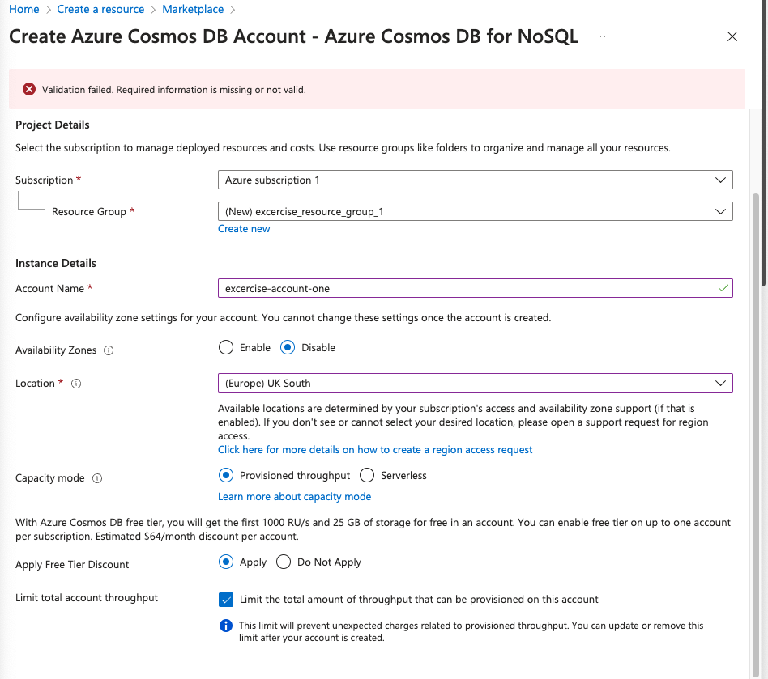

Then navigate to the review and create tab:

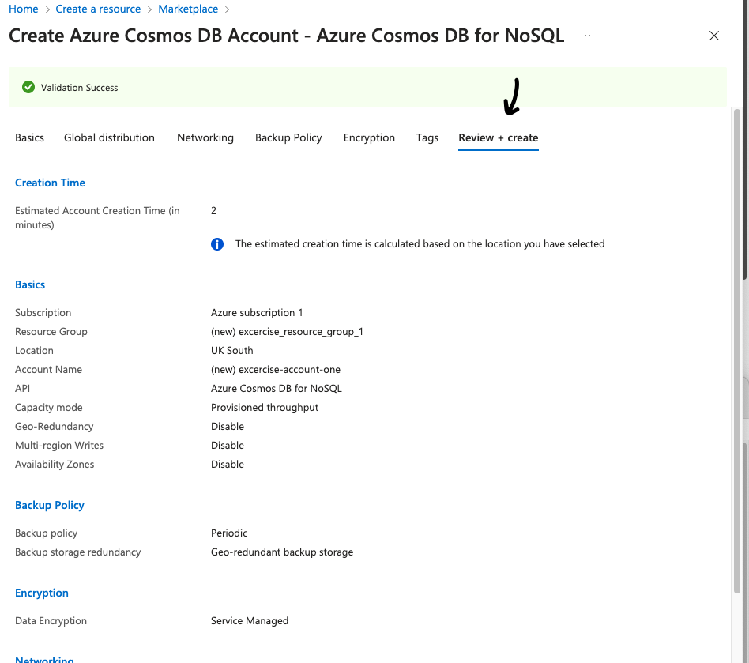

If you're happy with the settings click ```Create```. It'll take a couple of minutes to create the resource. Once the deployment is complete, the <strong>Deployment pane</strong> will update with a <strong>Deployment successful</strong> message. Then within the deployment pane we can select <strong>Go to resource</strong>.

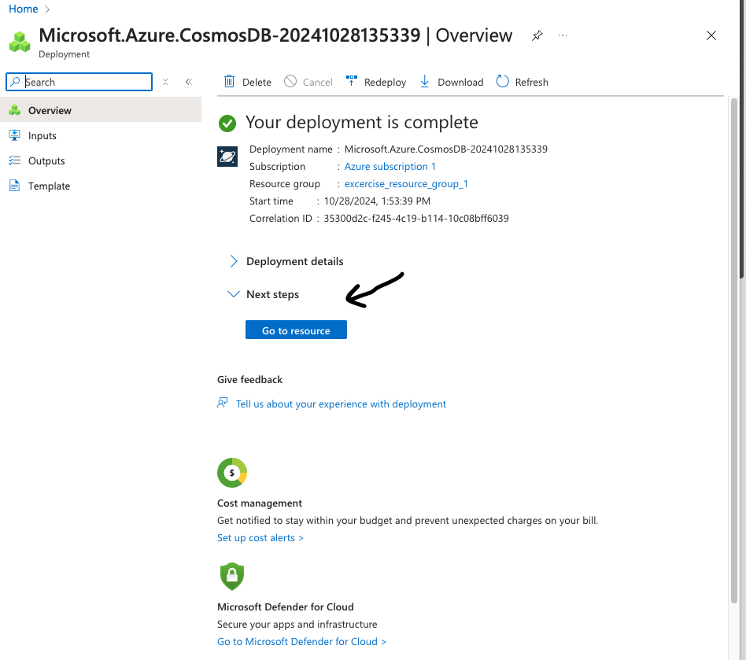

<strong>Navigate to Data Explorer</strong>

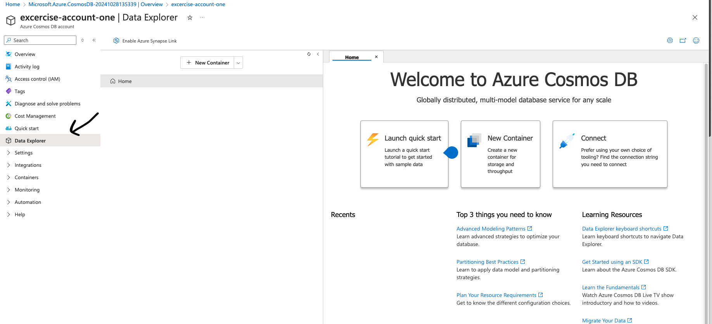

- From the <strong>Data Explorer</strong> pane, select <strong>New Container</strong>
- In the <strong>New Container</strong> popup, enter the following values for each setting, and then select OK:

| <strong>Setting</strong> | <strong>value</strong> |
|--------------------------|------------------------|
| <strong>Database id</strong> | ```cosmicworks``` |
| <strong>Share throughput across containers</strong> | Unchecked |
| <strong>Container id</strong> | products |
| <strong>Partition key</strong> | /categoryId |
| <strong>Container throughput (autoscale) | Manual |
| <strong>RU/s</strong> | 400 |

See also the screenshot below for a visual representation of the settings above:

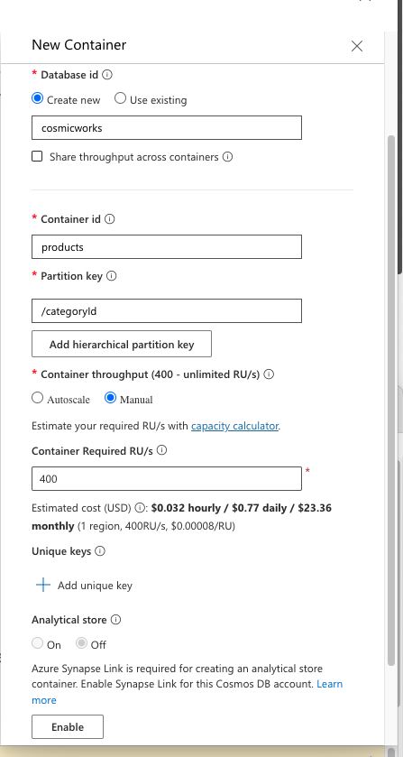

I've noticed that there is an activity log at the bottom which confirms that the ```cosmicworks``` database has been created.

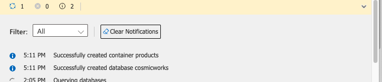

In this example we have created a new database after creating the container. In the real-world, I'd argue that we first create the database and then attach the container to the pre-existing database.

### Create Items

Now that we have setup our account, database, and container, we can use the Data Explorer pane to create our items (JSON files).

We simply expand the ```cosmicworks``` database node and the ```products``` container node and then select ```Items```.

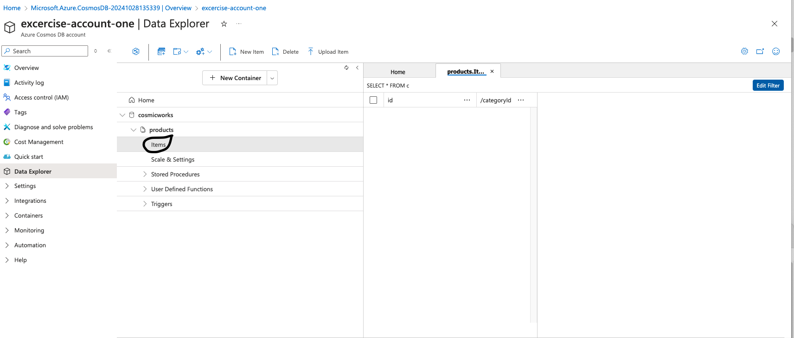

Then at the top panel, we select ```New Item```.

In the editor, replace the placeholder JSON item with the following content and select ```save```:

```JSON
{
  "categoryId": "4F34E180-384D-42FC-AC10-FEC30227577F",
  "categoryName": "Components, Pedals",
  "sku": "PD-R563",
  "name": "ML Road Pedal",
  "price": 62.09
}
```

Create one more new item and replace the placeholder JSON item with the following content and select ```save``` again:

```JSON
{
  "categoryId": "75BF1ACB-168D-469C-9AA3-1FD26BB4EA4C",
  "categoryName": "Bikes, Touring Bikes",
  "sku": "BK-T18Y-44",
  "name": "Touring-3000 Yellow, 44",
  "price": 742.35
}
```

Now we can see the two new items:

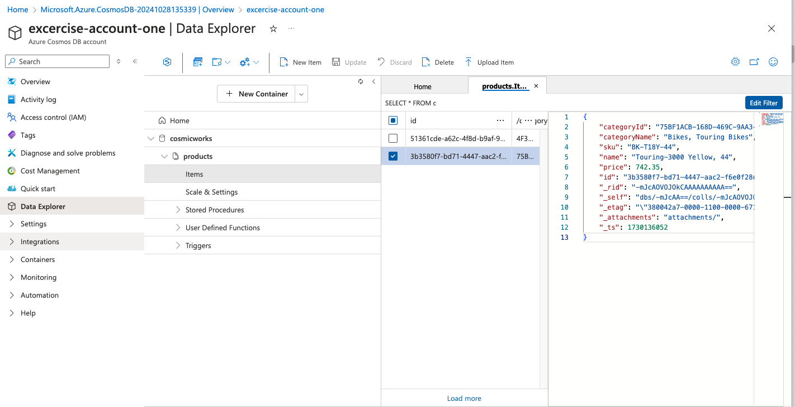

### Issue a basic query in the Data Explorer

In the top panel, click ```New SQL Query```

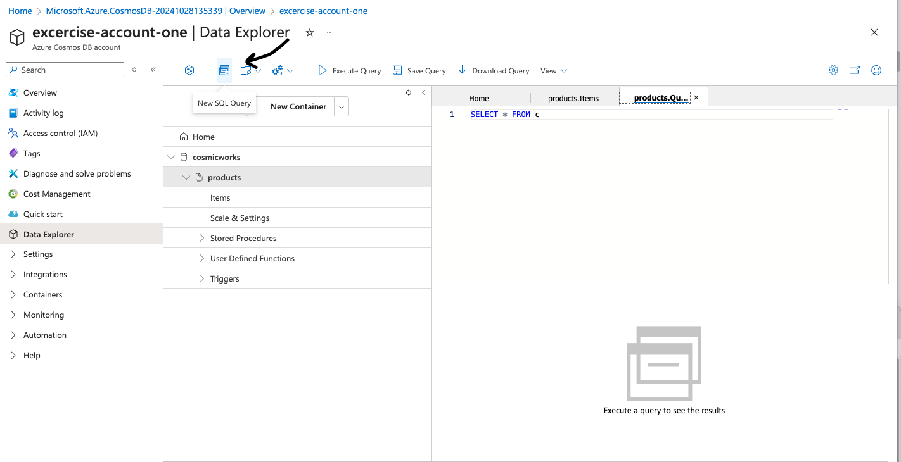

Write the query to select all items where price is greater than $500 and click ```Execute Selection``` in the top panel.

```SQL
SELECT * FROM products p WHERE p.price > 500
```

The query result is a JSON file with all its properties:

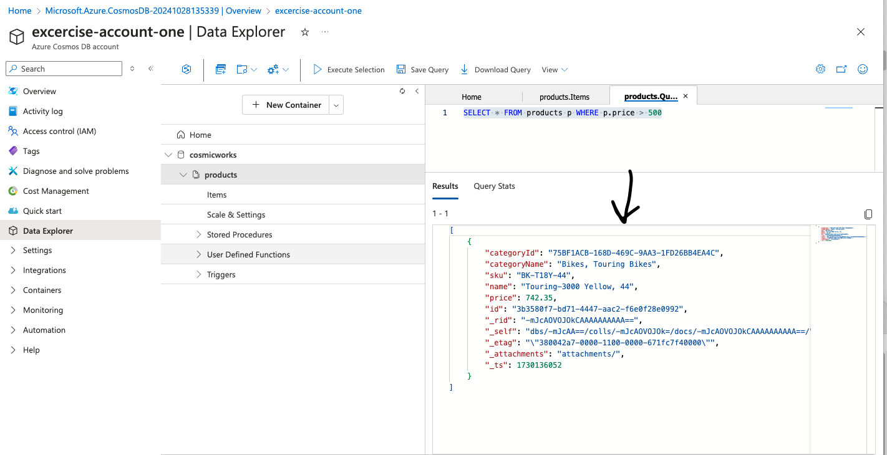

In the Query Stats tab, we can see that the there is a ```Request Charge``` metric which shows the cost in RU/s.

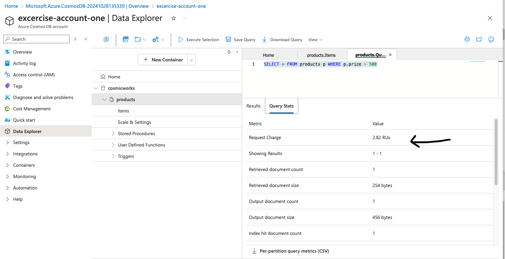

