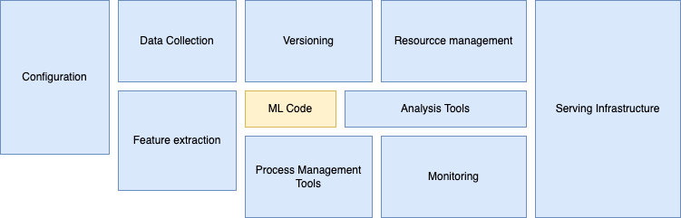

# Introduction to Learn MLOps basics of Continuous Integration, Delivery using Azure DevOps and Azure ML. Create MLOps pipeline in Azure

This is a [course on Udemy](https://tpximpact.udemy.com/course/mlops-course/learn/lecture/26345214#overview) to help get familiar with the basic principles of ML Operations.

<strong>What is MLOps?</strong>

As most people are probably familiar with, ML stands for Machine Learning model code development. Ops means to productionise and deploy the code. Therefore, MLOps is the integration of those to, meaning the ability to combine the two.

MLOps is defined as:
```A set of principles and practices to standardise and streamline the machine learning lifecycle management.```

We could elaborate with 4 more technical points:
1. It's not a new technology or tool. It's a culture with a set of principles and guidelines defined in the machine learning world to seamlessly integrate and automate the development phase with the operational deployment phase.
2. MLOps drive a seamless integration between the development and operational processes.
3. It's a process during which data scientists, data engineers, and operations collaborate to build, automate, test and monitor the machine learning pipelines.
4. MLOps drives inspiration from DevOps, therefore, the key DevOps principles are continuous integration, continuous delivery, and continuous training (CI/CD/CT). 

<strong>MLOps process broad phases</strong>

MLOps has three broad phases:
1. Designing the ML-powered application phase
2. ML research and experimentation phase
3. Operations phase

In most businesses, the teams working in the three phases are siloed, working independently, meaning that they lack a holistic view of the project. This means that data scientists are creating models on their local systems, not realising how difficult it could be to operationalise that model for engineers. In contrast, engineers, lacking proper knowledge and understanding of the data science skills, try to productionise whatever models their data science colleagues provide them with.

This scenario, which appears more often than not, means that each team speaks in their own "language" without much communication between them. Without having a streamline system in place, the ML models remain stagnated to a basic academic project level and never make it to production. With a set of MLOps principles these teams can work on a shared platform, staying interconnected and influence each other, while their roles in the project are properly defined. 

## Traditional Machine Learning Lifecycle

In a traditional machine learning lifecycle there are a few key phases:

<strong>Phase 1</strong>

Business understanding and planning phase, where business matter experts and data scientists get together to understand the problem, the project objectives, requirements, and how to bring value in it. After the problem is understood and the project goal is defined, then we move on to bring in the data.

<strong>Phase 2</strong>

Collection of data phase. The more data we use, the more likely for our model/s to get better results. Data can be collected from many different sources such as devices (IoT), files, web apps, mobile devices, and much more. 

Data also comes in many formats as a result of that. During this phase, we want to identify the different data sources and data types, the volume of data, how much data has already been collected and how much data it's projected to be collected in the future. 

The quality and quantity of the data collected in this phase, influences the efficiency and quality of the ML model output. Once we have collected the data, we need to store them, ideally in a data lake.

<strong>Phase 3</strong>

Phase 3 is data preparation and data wrangling. The raw data doesn't usually (or almost never) fit ML or AI models in its raw format. Data wrangling helps with that because it's a collection of steps such as, data pre-processing, data transformation, feature engineering, and exploratory data analysis. Once the data is clean and analysed, we can move to the next phase which is data modeling.

<strong>Phase 4</strong>

Data modeling in ML and AI means a different thing than what one would refer to as data modeling in data engineering or DevOps. In data engineering, data modeling is a visual representation/model of the data to define how an organisation's data is collected, managed, and used. It can also define data types, relationships, and database structure. 

In data science (ML/AI), data modeling is referring to machine learning or artificial intelligence data models. These models are usually based on statistics and they fall in different categories such as classifiers, regression, clustering. Or more generic categories such as supervised and unsupervised models. 

During phase 4 we choose which ML/AI data model/s best fit our problem and our data. Traditionally, data scientist will manually run and compare different models, but we have auto ML and auto AI tools nowadays that only require us to provide the model ready data (clean data from phase 3), and select some parameters (i.e., a target variable if we have one) and hyper-parameters and they use multiple combinations of models and features in the backend, providing us with statistics of the best performing models or model combinations fit our data best. This saves a lot of time from this stage.

<strong>Phase 5</strong>

The fifth phase is deployment of the model. We can do this by deploying the model into an existing production application or build a new one and start giving prediction on the real data to enhance business value.

There are a few ways a model can be deployed, depending on the use-case. The two most common ways are:

1. <strong>Model as a service:</strong> also known as live scoring model. When deploying using model as a service, the model is deployed into a framework to provide REST API end-point/s.
2. <strong>Embedded deployment:</strong> is when a model is packed into an application or software. Think of GPT-4, it's a multimodal model which is packed into the ChatGPT software.

So far, the lifecycle of a machine learning model is very similar to software or data engineering lifecycles. The difference comes here because although deployment is usually considered to be the last step of any normal application's lifecycle, for a ML project we have one more step/phase.

<strong>Phase 6</strong>

Phase 6 is considered the last step or phase of an ML project and it's the phase that differentiates an ML project from a normal application project.

In this phase, we need to set up a process so that we can monitor the performance of our model to make sure that it continuous to perform well over time.

The challenge with ML/AI projects is that over time, new data is generated. As the new data comes in and the data patterns change, the accuracy of the model, naturally, starts to deteriorate.

Therefore, we need to monitor the model performance in production in regular intervals by comparing the results of what the model predicted and what was the actual value in the data.

<em>Let's consider an example:
Say, we have deployed a model on the first of January that predicts daily customer transactions for our business. By the first of February (one month later), we are going to have access to the actual transaction data for the month of January as well as the predicted transactions from our model.

Using a script, we can compare the results and using an appropriate statistical formula we can determine the accuracy of our model. If the accuracy sits inside the accepted range then the model is fine. When the model starts to deviate from the accepted range, then we have to tune the model.
</em>

Model tuning is the process of retraining our model based on the new production data that has come in. This can be considered as the 7th phase or as part of the monitoring phase. Either way, it usually means that we repeat phases 2-6 since besides understanding the problem and the objective of our model, the rest of the ML project lifecycle such as data acquisition, pre-processing, creating a new model, and deploying that new model are part of the model tuning process. 

<em>It's good to keep in mind that traditionally, we iterate between phase 2, 3, and 4 until the data reaches a shape that suits the purpose and until we have a model or multiple models that provide us with the desirable accuracy levels.</em>

## Roles and responsibilities in ML projects

Now that we have a better understanding of the ML project lifecycle, we can understand the problems and challenges in the lifecycle that cause almost 80% of the models being build to never go into production. Here I am using the statistic reference in the Udemy course, but there are a few statistics out there, making it difficult to determine if there is an accurate statistic. A quick web search will indicate that the majority of the statistics and studies agree that only 15%-50% of ML or AI projects ever make it to production. It will be interesting to explore the reasons for that in another paper or blog-post.

This Udemy course will try to explain why later on, but in this part of the course we are exploring the various roles and responsibilities performed in an ML project.

<strong>Subject matter experts:</strong>

The subject matter experts have two main roles:

1. Provide the business questions, goals and KPIs to be achieved by the ML project. This makes them a crucial role for phase 1.
2. Continuously evaluate the model performance as its users. This makes them a crucial role for phase 6.

<strong>Data Scientists:</strong>

The data scientists are the core team members of any ML project. There roles and responsibilities fall into 3 main categories:

1. Selecting the algorithms
2. Build, train, and validate the model
3. Hyper-parameter tuning

They are a crucial part of phase 1, 2, 3, and 7 (retraining).

<strong>Data Engineers:</strong>

Data engineers work in parallel with the data scientists. They help the data scientists identify the data sources, building the necessary connections with the source data. The course allocates 3 key groups of roles and responsibilities to the data engineers:

1. Data acquisition and building of the data lake
2. Data wrangling, cleaning, and transformations
3. Building ETL pipelines

As someone who has worked as a data scientist and a data engineer, I have to note here that both data scientist and data engineers do a lot of data wrangling, cleaning and transformations, so I don't think it's as separated as the course makes it seem.

<strong>ML Engineers:</strong>

The ML engineers are made up of a mix of ML engineers, application developers, DevOps, and platform engineers. Often these roles are clamped together and are performed by a single team or set of engineers and different companies might use different names to represent them.

Once the model is confirmed by the data scientists they will pass it to the ML engineers to:

1. Operationalise the model
2. Deploy the model

In some cases, if the model provided by the data science team is trained only on a specific set of data as a proof of concept, then the ML engineer will be responsible to train it on the full dataset to prepare it for production. This is what we call operationalising the model, making it operational and ready for production purposes.

The deployment of the model is the most important job of the ML engineers since it's the step that integrates the model with the current running applications or create a new one and productionise it. Since the model code is of not use to the end customer, the ML engineers need to deploy it and package it in a user-friendly manner.

If the model is deployed as a service, then the ML engineers will write the REST API code, or if it is deployed as embedded, then the team will embed the model file into the application/software and the final product with the embedded model will go into production.

<em>The ML engineers are the people who decide what and how exactly the model will go into production.</em>

Generally, these are the roles. If you are a big team/company, you might have a few more roles such as dedicated back-end engineers, platform engineers who provide the team with VMs, machines and CPU/GPU infrastructure. Basically, they provide you with the tools you need to run and test what you've built. 

## Problems with traditional ML lifecycle

Above we've explored the traditional ML lifecycle. Now that we all understand this, we can explore the problems that this "traditional" lifecycle has. 

<strong>Problem Statement: Proof Of Concept (POC)</strong>

Once the problem is defined, the data is collected and pre-processed by either a data scientist or a data engineer, the data scientist will take that data and build ML models on his local machine. They take a sample of the data, and usually using tools like Jupyter Notebook, they'll build and refine models until the model is ready, <strong>ready in the local development system</strong>.

Data scientists are trained in developing high-performing algorithms, mathematics, and statistics. There strengths lie in statistical analysis and ML models, not in writing code that is robust, scalable, and manageable.    

<strong>How is the model moved to the next phase?</strong>

The operational people are responsible for this step. They need to make it production ready and deploy it. This usually happens by the data scientists passing their Jupyter notebooks over mail, USB, or shared drives. <em>In my personal experience, data scientists pass their notebooks to the operational people (engineers and DevOps), using git</em>, so it's not as bad as sending it over mail, USB, or shared drives. Still not perfect though.

<strong>The operational team's tasks:</strong>

The operational team, upon receiving the notebooks from the data scientists, they need to train the model on bigger data sets and integrate it with some application. 

There are some issues here:
- The two teams don't speak the same language
- The two teams don't use the same tools
- The engineering team doesn't know:
    - the required dependencies
    - the required packages
    - what feature parameters the model is trained on
    - what variable represents the model's output values
    - what is the data format to be fed to the model
    - is the model production ready

In some extreme cases, the whole model needs to be created by a data engineer and in a different language. This means that the model will take a different shape than its original purpose and build.

This transition is a repetitive and error prone process, creating a virtual wall between the functioning and thought process of the data scientists and the operational team.

<strong>High-level ideas for breaking the wall:</strong>

- Data scientists need to sit with the operations team and support them in understanding the things.
    - Constant communication between the two so that the operations teams can ask questions.

The issue with that it seems to be that for the data scientists to engage meaningfully with the operations team, they'll have to spend 40%-50% of their time in non-modeling related activities which seems to be hard to justify and it can be considered as inefficiency.

This is a main issue with the current process of how ML projects are being handled today and it is the main reason for why 80% of the models never make it to production.

## Activities needed to productionise models

The poductionisation of ML models isn't a smooth process. It involves a lot of activities (as we've already touched in this document). 

Even if we assume that there is no knowledge gap between the data science and operational teams, there are still lots of things to consider and do before the final deployment.

### The steps to production:

<strong>1. Package</strong> after the model is built, we have to:
    
    - Compile/package the code
    - Resolve dependencies
    - Run scripts

<strong>2. Performance</strong> - training the model with big data is not a quick thing. It may take hours or days for a single run. Therefore, performance is a key parameter that we will be concerned with. We are going to look for:

    - Scaling out to train big data
    - Model performance for big data
    - Load balancing
    - Add parallelism
    - Data partitioning
    - Take GPU support
    - Model prediction speed

<strig>3. Instrument</strong> - once the model performance is sorted, we have to think about the instrumentation aspects of the ML project such as:

    - Versioning, repo management, security, monitoring
    - Versioning of algorithm + data + feature parameters + environment (this goes beyond traditional application versioning. Versioning all the different pieces that go into the ML model project is more complex than simply versioning one thing)
    - Reproducibility

<em>In classical software development, a version of the code alone, produces a version of the software. In machine learning, a version of the code, a version of the data, and version of feature parameters produce a version of an ML model. Models work different in different environments, so we might need to monitor that as well.</em>

<em>Monitoring is a key aspect of any software project, including ML models. When it comes to monitoring, we don't simply monitor accuracy and health of the model, we also need to monitor the data for both quality and drift. After the model deployment, we should check if the data and statistical properties are we expected. If not, the model accuracy is going to hamper. On top of data monitoring, we have the usual system-wide monitoring, checking for latencies when calling the machine learning model, system health, memory CPU usage, disc utilisation, etc... Because of the ML project monitoring challenges, traditional monitoring methods don't provide it out of the box.</em>

<em>Model degradation is a purely manual task. In the worst case scenario, there is no performance monitoring or feedback loop in place and the only feedback we get is from our end users.</em>

<strong>4. Automation:</strong> everything we've explored so far, data acquisition, data pre-processing, data modeling, are manually done. They take lots of time. Imagine we struggle and put a model into production and one month later, the model needs retraining. Retraining means that we follow the whole lifecycle again.

    - Lots of manual tasks
    - Continuous training required

<strong>ML Technical Debt</strong>



The diagram above is taken from a paper published a few years ago by Google called [Hidden Technical Debt in Machine Learning Systems](https://proceedings.neurips.cc/paper_files/paper/2015/file/86df7dcfd896fcaf2674f757a2463eba-Paper.pdf), and it clearly showcases all the activities that take place in ML projects. The ML code occupies a very small portion of the process in the middle.

## Conclusion of the Introduction Part

Now we've defined what activities constitute a machine learning project lifecycle, we understand that the ML code is a very small part of the process and that there is a large "hidden" technical debt to the ML projects, we can move on to the next paper/post where we are going to explore the proposed solution to the challenges we explored.