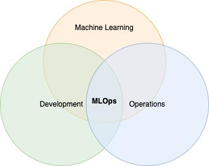
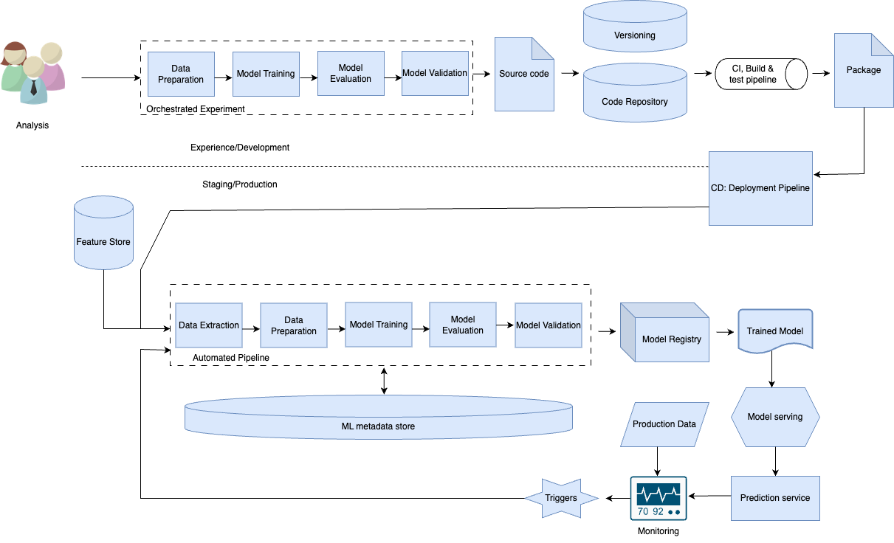
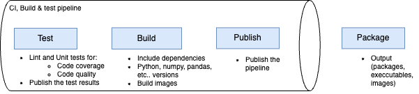

# Solution Proposal - Learn MLOps basics of Continuous Integration, Delivery using Azure DevOps and Azure ML. Create MLOps pipeline in Azure

This section starts with a definition to MLOps:

<strong>MLOps</strong> is a culture with a set of principles and guidelines, defined in a machine learning world to seamlessly integrate/automate the development phase with the operational phase.

With MLOps, we break the silos of data scientists, data engineers, and operation teams, allowing them to work in a single ecosystem.



In MLOps, all three stages of development, machine learning, and operations are interconnected and influence each other.

## Define Standards/Principles

<strong>Transition friction</strong>. The first standard we want to define is how we can transition between a data scientist's notebook and an ML engineers code. This can be done by:

- The use of notebook templates that define common functionality such as database connection template, how we fetch data, etc..
    - The idea is to create agnostic code that both parties can understand.
- The introduction of proper documentation. From personal experience, I can tell you that this is a challenge for every project, data engineering, software engineering, and ML engineering.
    - In the documentation, all the dependencies and other action items are listed so that ML Engineers can use that file as reference while building their code.

<strong>Version Control System</strong> for:

- Code
- Data
- Environments
- Artifacts

With proper versioning in place, experiment tracking can become easier since anyone can see that a particular model version was run and know the:

- Version of data
- Algorithm used
- Accuracy of the model

This will allow teams to easily compare the results of various permutations and combinations of other runs of models and data.

<em>A good version control system will solve the problems of reproducibility since if at any point in time someone asks you to redeploy a model, you will have all the metadata saved for it. Simply choose the desired versions of code and datasets and the model can be reproduced and redeployed.</em>

<strong>Performance</strong>. To help with performance, we need to take advantage of:

- Distributed computing
- Containerisation (e.g. Docker, Kubernetes)
    - Containerisation is becoming a standard solution to the headaches of dependencies when deploying ML models. 
    - Container technologies/tools such as Docker, are lightweight alternatives to Virtual Machines (VMs), allowing applications to be deployed in independent self-contained environments, ensuring that those environments will match the exact requirements of the model.
        - In containerisation, compute resources for the model can scale elastically using multiple containers. And for orchestrating these containers we can use Kubernetes.

<strong>Automation</strong>. What if we can induce automation in the whole process rather than developing a model every time and putting the model into production, what if we:

- Build workflows, CI/CD pipelines
    - Include all the phases required for its creation and put that pipeline itself inn production?
- Build an MLOps process that is pipeline centric:
    - Rather than deploying a model every time, you deploy your whole model creation code itself as pipelines in the production environment, essentially automating the complete ML workflow steps, without needing manual intervention.

In the traditional machine learning project lifecycle, the whole process is machine learning model centric; collecting the data manually, pre-processing the data manually, creating the models and comparing them manually in notebooks, tuning the model, etc...

The MLOps is pipeline centric instead. You put your main efforts in the beginning to build a pipeline for all those steps. This will allow you to just click through a couple of buttons or do nothing if it is working on a schedule, whenever you want to train or deploy a model.

<strong>Monitoring</strong>. When you launch the model, in MLOps we can:

- Use powerful innovative monitoring tools to monitor the data, features, distribution, latency, uptime, memory utilisation, model accuracy, and other important measures.
- We can use monitoring tools such as Prometheus and Grafana to do that.

<strong>Continuous Training</strong>. This is the last standard we need to account for. We need to continuously retrain our model/s and we can do this by:

- Automated retraining of models based on triggers or regular frequency.
    - For example, we can have a trigger that retrains the model as soon as X amount of new data or features are introduced in the datalake.

The above list showcases the basic standards and principles of MLOps. Below, this process is showcased in a flow-diagram format, taken directly from the Udemy course:



The 5th step in the flowchart is the CI Build & test pipeline. Here, like in software development, we write our unit tests, we build the images and we publish.



We deploy this in a package. When we reach this step, we have in essence, achieved Continuous Integration and Continuous Delivery of the model.

If we want to go one step above in terms of automation, we can go ahead and deploy a CD deployment pipeline.

The next step is the automated pipeline as seen in the flowchart. Here, every time a model goes through the pipeline, the model will be registered in the ```model registry``` for versioning and to maintain the lineage.

A model registry acts like a centralised hub, capturing all the model related metadata such as:

- Identifier
- Name of model
- Version of model
- Version of data
- ETC...

Once the trained model reaches the targeted accuracy level, it's served as an API in the ```model serving``` step (using REST end-points). This deployment can take place with any strategy that fits our purpose such as:

- A/B testing
- Canary deployment rollback
- Blue/green deployment
- ETC...

Lastly, we do continuous training based on some pipeline triggers of our choice. We monitor all the changes that we can monitor based on the model changes that are bound to happen with production data.

Once a CI/CD and CT pipeline is implemented, there would be less manual interventions since the model will be able to extract new data, prepare the new data, train the new model, evaluate it, and validate it automatically.

## Benefits of MLOps

An MLOps process brings a few benefits.

- First, removing silos from data science, data engineering, and DevOps teams, by creating a shared language among the extended team
- It introduces a lot of automation, enabling us to retrain and re-deploy models in minutes

<strong>Data Scientists</strong> no longer need to be part of the whole MLOps cycle but focus on building the source code of the model and packaging it, saving them lots of time and effort to focus on what they do best.

<strong>ML Engineers</strong> get less resistance from understanding the experiment that the data scientists have developed and they can reproduce it easily since proper documentation has been provided. Furthermore, once the pipeline is developed, data scientists can go and add changes to their code directly into the pipeline, removing pressure from the data engineers.

<strong>Application Developers</strong> don't need to change the code every time the model is changed. The model and the application are decoupled from each other. This is possible since the models are developed as an independent API end-point.

<strong>Risk & Compliance teams</strong> benefits from the MLOps infrastructure since it allows to streamline the internal processes. Since the complete lineage of data and models is maintained so the auditing process is smoother.

<strong>Clients</strong> can make better business decisions since they always have the updated model giving them up-to-date prediction. This becomes feasible since the model monitoring and retraining are automated in the MLOps pipeline, allowing retraining to happen in exponentially less time than when the process is manual and continuously.

## Difference between DevOps and MLOps

DevOps and MLOps share similarities since MLOps is inspired by DevOps, but they also have differences.

The differences are derived from the fact that MLOps has to work with the machine learning process, introducing some complexities that DevOps doesn't need to deal with.

<strong>DevOps vs MLOps</strong>

| <strong>DevOps</strong> | VS | <strong>MLOps</strong> |
|-------------------------|----|------------------------|
| Team is comprised of DevOps Engineers | VS | Diverse team including Data scientists, ML engineers, Data engineers, and DevOps |
| Linear development cycle | VS | Iterative development cycle |
| Versioning of code alone | VS | Versioning of code, data, features, environments, etc.. |
| Projects are not compute intensive | VS | Projects are compute intensive |
| CI comprises of testing and validating the code | VS | CI comprises of testing and validating the code and data |
| CD comprises of deploying a service | VS | CD comprises of deploying multiple pipelines (continuous retraining) |
| Monitor throughput, latency, CPU utilisation, etc... | VS | Monitor model accuracy, data drift, features along with the basic health checks (including making sure there isn't any bias in the model results) |
| DevOps is Continuous Integration and Continuous deployment | VS | MLOps is Continuous Integration, Continuous deployment and Continuous training |

The next document will explore the different maturity levels of MLOps as well as MLOps Tools and Platforms.